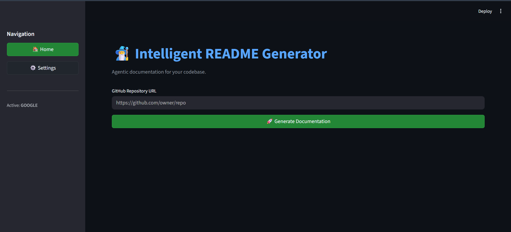
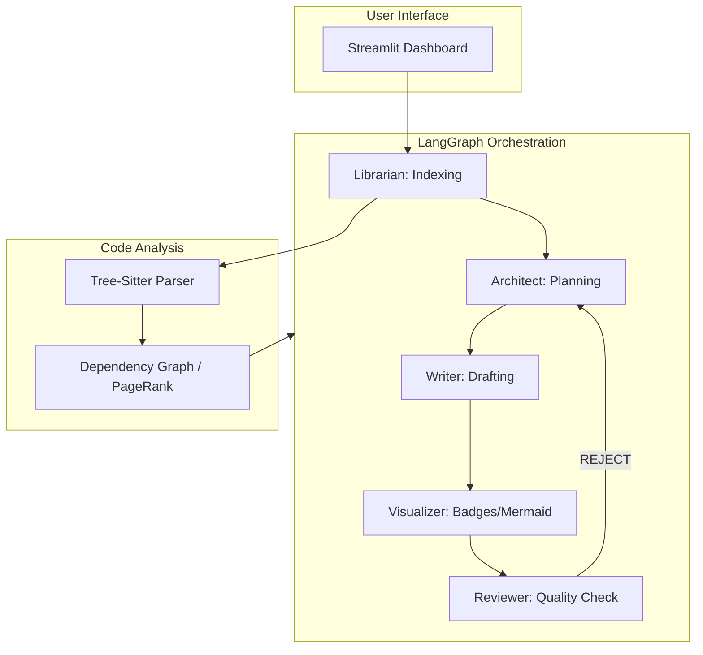

<div align="center">
  
  <h1>🧙‍♂️ Intelligent README Generator</h1>
  <p><b>The "Mirror Image" Agentic Documentation Engine</b></p>

  <p>
    
    
    
    
  </p>
</div>

<br />

> [!IMPORTANT]
> This tool analyzes your entire codebase using PageRank-inspired file prioritization and multi-agent consensus to generate Stripe-quality documentation.

## 🚀 Quick Start

```bash
# Clone the repository
git clone https://github.com/mushfiqk47/intelligent-readme-generator.git
cd intelligent-readme-generator

# Install dependencies
pip install -e .

# Setup environment variables
cp .env.example .env
# Edit .env and add your API keys (Google Gemini, OpenAI, etc.)

# Launch the Dashboard
streamlit run src/main.py
```

## ⚙️ Configuration

The application uses environment variables for configuration. You can find a template in `.env.example`.

### Key Variables:
- `ACTIVE_PROVIDER`: The LLM provider to use (`google`, `openai`, `anthropic`, etc.)
- `GOOGLE_API_KEY`: Your Google Gemini API Key.
- `GITHUB_TOKEN`: Recommended to avoid rate limits when fetching repository data.

### Supported Providers:
- **Cloud LLMs**: All flagship models (GPT-4o, Claude 3.5 Sonnet, Gemini 1.5 Pro).
- **Local LLMs**: LM Studio / Ollama via OpenAI-compatible endpoints.

Refer to the **Settings** tab in the UI for real-time configuration.

## ✨ Key Features

- **🔍 Multi-Agent Brain**: Librarian, Architect, Writer, and Reviewer agents collaborate to ensure accuracy and tone.
- **🛡️ Quality Assurance**: Automatically detects web projects and generates comprehensive **Playwright** E2E test documentation.
- **📊 Smart Context**: Uses a custom `ContextBuilder` that ranks files by importance, ensuring the LLM sees your most critical logic first.
- **🔌 Provider Agnostic**: Native support for OpenAI, Anthropic, Google Gemini, Groq, and OpenRouter.

## 🏗️ Technical Architecture



## 🧪 Quality Control (Playwright)

For web-based repositories, the generator automatically scaffolds a Playwright testing section:

```typescript
import { test, expect } from '@playwright/test';

test('README content should be high-fidelity', async ({ page }) => {
  await page.goto('/');
  await expect(page.locator('h1')).toContainText('Intelligent');
});
```

---

<div align="center">
  <sub>Built with ❤️ by Mushfiq Kabir. Optimized for Professional Engineering Teams.</sub>
</div>
