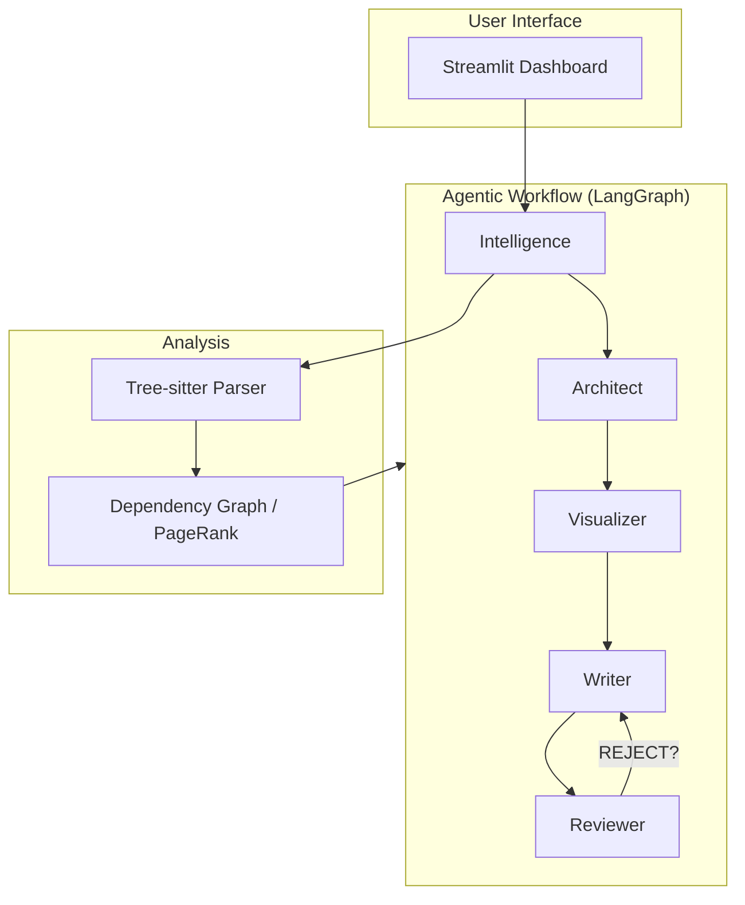

<div align="center">


# 🧙‍♂️ Intelligent README Generator  
**Agentic documentation engine that builds production-grade READMEs from your codebase.**

[](https://python.org)
[](https://github.com/langchain-ai/langgraph)
[](https://streamlit.io)
[](https://opensource.org/licenses/MIT)

[Overview](#-high-level-overview) • [Features](#-key-features) • [Demo](#-demo--screenshots--live-link) • [Quick Start](#-installation--setup) • [Usage](#-usage) • [Config](#-configuration--environment) • [Contributing](#-contribution-guidelines)

</div>

---

## 🏷️ Project Title & Value Proposition
Intelligent README Generator (IRG) — an agentic workflow that ingests your repo, understands its architecture, and produces a Stripe-quality README tailored to business and developer audiences.

---

## 🌐 High-Level Overview
IRG reduces onboarding friction by:
- Cloning and ranking your codebase with a PageRank-inspired analyzer.
- Orchestrating multi-agent roles (Intelligence → Architect → Visualizer → Writer → Reviewer) via LangGraph.
- Delivering a polished README with badges, diagrams, and review feedback loops.

---

## ✨ Key Features
- **Multi-Agent Brain:** Intelligence, Architect, Visualizer, Writer, Reviewer collaborate for accuracy.
- **Smart Context Builder:** Tree-sitter parsing + dependency graph ranking to prioritize important files.
- **Provider Agnostic:** OpenAI, Anthropic, Google, Groq, OpenRouter, or local LLMs.
- **Visual Assets:** Pre-generated shields + Mermaid architecture diagrams.
- **CLI + UI:** Streamlit dashboard and CLI share the same workflow for consistency.

---

## 🖼️ Demo / Screenshots / Live Link
- UI preview: see `UI.png` (above).  
- Live link: _not published yet_ (run locally via Streamlit).

---

## 🧰 Tech Stack
- **Frontend:** Streamlit
- **Orchestration:** LangGraph (LangChain)
- **LLM Providers:** OpenAI, Anthropic, Google, Groq, OpenRouter, Local (Ollama/LM Studio)
- **Parsing/Ranking:** tree-sitter, NetworkX PageRank
- **Language:** Python 3.11+

---

## 🚀 Installation & Setup
```bash
# 1) Clone
git clone https://github.com/mushfiqk47/intelligent-readme-generator.git
cd intelligent-readme-generator

# 2) Create environment (recommended)
python -m venv .venv
source .venv/bin/activate  # on Windows: .venv\Scripts\activate

# 3) Install
pip install -e .

# 4) Configure env
cp .env.example .env
# Fill in provider keys (see Configuration)
```

---

## 🧭 Usage
### Streamlit UI (recommended)
```bash
streamlit run src/web.py
```
- Paste a GitHub repo URL, optionally add custom focus, adjust token budget, and generate.
- Download the produced README or copy from the Raw Markdown tab.

### CLI
```bash
python -m src.main <owner> <repo> --output GENERATED_README.md --focus "api docs first"
```

---

## 🔧 Configuration & Environment
Configure via `.env` or the in-app **Settings** tab.

| Variable | Description |
| :--- | :--- |
| `ACTIVE_PROVIDER` | `google`, `openai`, `anthropic`, `groq`, `openrouter`, or `local`. |
| `OPENAI_API_KEY`, `ANTHROPIC_API_KEY`, `GOOGLE_API_KEY`, `GROQ_API_KEY`, `OPENROUTER_API_KEY` | API keys per provider (optional but required for respective provider). |
| `MODEL_PLANNER` / `MODEL_WRITER` | Model names for planning/writing (e.g., `gpt-4o`). |
| `GITHUB_TOKEN` | Recommended to avoid GitHub rate limits. |
| `LOCAL_LLM_BASE_URL`, `LOCAL_LLM_MODEL` | For local/LM Studio/Ollama setups. |

---

## 🛠️ Architecture (How It Works)


---

## 🤝 Contribution Guidelines
- Issues: open with clear reproduction steps or feature context.
- PRs: keep changes focused; include before/after notes and tests when applicable.
- Branching: `main` is stable; use feature branches and PR reviews.

---

## 🗺️ Roadmap (high-level)
- Pre-flight repo validation and richer error messaging.
- More deterministic badge extraction from project metadata.
- Optional hosted demo deployment path.

---

## 📄 License
MIT License. See [LICENSE](LICENSE) for details.

---

## 👤 Author & Acknowledgments
Built with ❤️ by **[Mushfiq Kabir](https://github.com/mushfiqk47)**  
Optimized for professional engineering teams and fast onboarding.